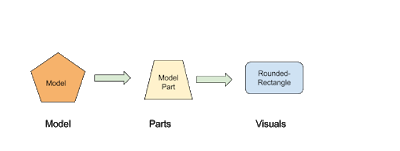
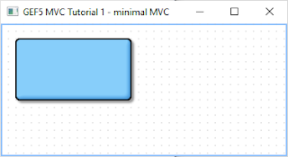
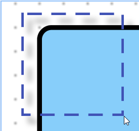
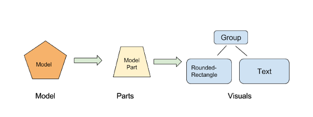
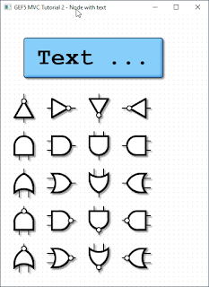
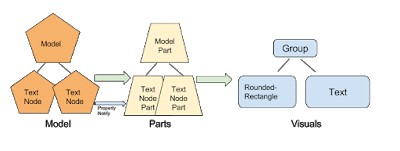
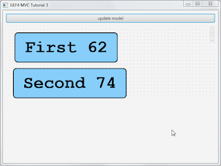
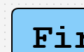
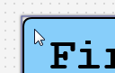
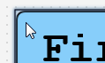

GEF 5 tutorial
==============
:icons: font
:toc:

Author Frank Benoit <fr@nk-benoit.de>

== Part 1 - Minimal MVC

This is a re-make of my previous +
https://fbenoit.blogspot.com/2015/11/gef4-tutorial-part1.html[GEF4 tutorial],
now for GEF5.

The source for this tutorial can be retrieved from github:
https://github.com/frankbenoit/gef5.mvc.tutorial/tree/master/gef5.mvc.tutorial1/src/gef5/mvc/tutorial[gef5.mvc.tutorial1].

GEF5 is the Graphical Editing Framework in the Eclipse ecosystem.
See: https://github.com/eclipse/gef/wiki/MVC
See: http://nyssen.blogspot.com/2017/02/gef4-1-gef-5.html#Merger%20of%20MVC%20and%20MVC.FX[GEF4 + 1 = GEF 5]

I have special interest in the Model-View-Controller part of this framework, 
but at the time of my writing, there is only the "Logo" example available. 
I found it quite complex, for understanding the basic concepts. 
So I started to reduce it and thought others could have a benefit from my work. 
Let's see.

=== Tutorial step 1

The most trivial example for MVC, is having

 * a model +
   The model is a POJO, storing information only application specific information.
   Here i store the rectangle coordinates and the color, of what i want to visualize.
 * a controller (in GEF4+ speak "Part") + 
   The part is a class implemented by the project to convert the model into visuals.
   It implements the IContentPart interface.
 * the visual +
   The elements from JavaFX or their abstractions from GEF
 

GEF makes use of Google Guice.
You may have a read about it to understand the concept:
https://github.com/google/guice, see the linked video there and the user guide.

For this simple example, we need only to configure a single binding,
to inject out ModelPartFactory into GEF.

[source,java]
....
protected void configure() {
    super.configure();
    bind(IContentPartFactory.class).to(ModelPartFactory.class);
}
....

When the application's model objects are passed into the GEF MVC as content, 
the ModelPartFactory is responsible to create the model parts. 

See in `Gef5MvcTutorial1.java`
[source,java]
....
viewer.getContents().setAll(createContents());
....

For one content object, one model part is created.
The ModelPartFactory might use instanceof tests to check for the model types 
and create the appropriate part class instance. 
Also information of the model may be used to determine the correct type for the 
part.

The ModelParts in this example extend AbstractContentPart<GeometryNode<RoundedRectangle>>.
I want to draw a RoundedRectangle, which is a GEF5 geometry.
The GeometryNode is an adaption to have it as FX Path. 
The AbstractContentPart is an abstract content part implementation, 
acting on the given JavaFX node element, here the GeometryNode. 

=== MVC structure

There is a single model object that a single part transfers into a single visual object.

The model object is set as the content for the viewer (see above), this calls the 
IContentPartFactory to create the right IContentPart.

The content part is then responsible to create the visual, the JavaFX objects 
to represent.

Now it looks like this:

You see a viewer with the grid dots.

The rounded rectangle is shown with a drop shadow effect. It is configured in 
gef5.mvc.tutorial.Gef5MvcTutorial.configureGlobalVisualEffect(IViewer)

.Realize what you can do with it:
 - Mousewheel can do up/down left/right scrolling
 - Ctrl+Mousewheel is zooming
 - With the mouse, you can drag a mark rectangle open, but it is not yet marking.

== Part 2 - Multiple Visuals

In this step 2 of the tutorial, we will have composed visuals.

A text node, that is a rounded rectangle from before, but with a text in it and 
the dimension of the rectangle is adjusted by the text.

And there will be symbols for logic gates, that illustrate how to work with 
Circle, PolyLine, Path, ...

For the source code see github 
https://github.com/frankbenoit/gef5.mvc.tutorial[gef5.mvc.tutorial2]

The ModelParts are now extending AbstractContentPart<Group> this allows to have 
multiple child nodes and to compose the visual presentation.

=== MVC structure

Compared to step 1, the visual is now a composition of multiple objects.

=== The result

Now it looks like this:

== Part 3 - Model hierarchy and updates

In step 3 of this tutorial, the model is a tree structure.

=== The model tree

[plantuml, part3-model, png]
....
object root
object textNode1
object textNode2
root --> textNode1
root --> textNode2
....

The parts will be created in a 1 to 1 tree. 
And the visuals are then created by each part individually.

For the source of this tutorial step see github - 
https://github.com/frankbenoit/gef5.mvc.tutorial/tree/master/gef5.mvc.tutorial3/src/gef5/mvc/tutorial[gef5.mvc.tutorial3].

That tree structure of the model means, the viewer gets only a single object 
assigned as content, the instance of root. 
The ModelPart implements the doGetContentChildren, to tell GEF about more 
content children:

[source,java]
....
@Override
public List<? extends TextNode> doGetContentChildren() {
    Model model = getContent();
    return model.getNodes();
}
....

=== Update UI on model change

The model and part elements need to implement some type of update mechanism. 
Here the bean property listeners are used. You might use the javafx 
ObservableValues or something else.

Normally the part shall depend on the model, but the model not on the part.

However, in the end the "refreshVisual()" of the part needs to be called.

This example has a button on the top, that applies changes to the model. 
So the text and the position of the boxes is varied.

== Part 4 - Dragging and store to model

In step 4 of this tutorial, the text nodes can be dragged around with the mouse.
The new positions are stored into the model object.

The model as whole is restored and persisted at application start and end.

For the source of this tutorial step see github - 
https://github.com/frankbenoit/gef5.mvc.tutorial/tree/master/gef5.mvc.tutorial4/src/gef5/mvc/tutorial[gef5.mvc.tutorial4].

=== Restoring and persisting the Model

For mapping the model, here object serialization is used.

The model class TextNode implements the 
[source,java]
....
private void writeObject(java.io.ObjectOutputStream s) throws java.io.IOException {
    s.writeDouble(position.get().x);
    s.writeDouble(position.get().y);
    s.writeUTF(text.get());
}

private void readObject(java.io.ObjectInputStream s) throws java.lang.ClassNotFoundException, java.io.IOException {
    reset();
    double x = s.readDouble();
    double y = s.readDouble();
    String t = s.readUTF();
    position.setValue(new Point(x, y));
    text.setValue(t);
}
....

In the applications start and stop methods, the loading and persisting code is 
integrated.

=== The Adapter pattern used in GEF5

Eclipse support the Adapter pattern, see this article:

http://www.eclipse.org/articles/article.php?file=Article-Adapters/index.html

In summary, it means, objects in Eclipse context that implement the IAdaptable 
interface, can give an implementation of a requested interface.

In GEF, this pattern was enhanced. 

See this article by Alexander Nyßen:
http://nyssen.blogspot.de/2014/11/iadaptable-gef4s-interpretation-of.html[IAdaptable - GEF4's Interpretation of a Classic ]

In addition to the Eclipse adapters, in GEF5, adapters can be configured at 
runtime, can exists for the same interface type in different roles, can have a 
reference to the adapted object.

=== The GEF Guice global defaults

Those are the binding, where one type is bound to an implementation class or 
instance. Optionally a scope can be applied.

[options="header",cols="1,1,1"]
|===
|Binding               |Bound to                  |Scope   
//------------------------------------------------------------
| IUndoContext         | UndoContext              |
| IOperationHistory    | DefaultOperationHistory  |
| IDomain              | HistoricizingDomain      |
| IViewer              | InfiniteCanvasViewer     |
| IRootPart            | LayeredRootPart          |
| AbstractVisualPart   | AbstractVisualPart       |
| AbstractContentPart  | AbstractContentPart      |
| AbstractFeedbackPart | AbstractFeedbackPart     |
| AbstractHandlePart   | AbstractHandlePart       |
| IHandlerResolver     | DefaultHandlerResolver   |
| ClickDragGesture     | ClickDragGesture         | IDomain
| HoverGesture         | HoverGesture             | 
| PinchSpreadGesture   | PinchSpreadGesture       | IDomain
| RotateGesture        | RotateGesture            | IDomain
| ScrollGesture        | ScrollGesture            | IDomain
| TypeStrokeGesture    | TypeStrokeGesture        | IDomain
|===

Sometimes this binding is needed to be known. E.g. in part 1, the effects were
applied to the content layer of the LayeredRootPart. Because the binding was
known the cast was possible.

However, all those binding can be changed in the Guice module.

And then, there are the bindings for the adaptables. Here we have as well a lot
of defaults:

[options="header",cols="1,1,1,1"]
|===
|Binding               |Adaptable role | Adapter role                     | Bound to   
//------------------------------------------------------------------------------------
| IDomain              |               | default                          | ClickDragGesture
| IDomain              |               | default                          | HoverGesture
| IDomain              |               | default                          | TypeStrokeGesture
| IDomain              |               | default                          | RotateGesture
| IDomain              |               | default                          | PinchSpreadGesture
| IDomain              |               | default                          | ScrollGesture
| IDomain              |               | contentView                      | IViewer
| IDomain              |               | default                          | IHandlerResolver in(IDomain)
| IViewer              | contentViewer | default                          | IContentPartFactory
| IViewer              | contentViewer | default                          | ContentPartPool
| IViewer              | contentViewer | default                          | GridModel
| IViewer              | contentViewer | default                          | FocusModel
| IViewer              | contentViewer | default                          | HoverModel
| IViewer              | contentViewer | default                          | SelectionModel in(IViewer)
| IViewer              | contentViewer | default                          | SnappingModel
| IViewer              | contentViewer | default                          | IRootPart in(IViewer)
| IViewer              | contentViewer | FOCUS_FEEDBACK_PART_FACTORY      | DefaultFocusFeedbackPartFactory
| IViewer              | contentViewer | HOVER_FEEDBACK_PART_FACTORY      | DefaultHoverFeedbackPartFactory
| IViewer              | contentViewer | SELECTION_FEEDBACK_PART_FACTORY  | DefaultSelectionFeedbackPartFactory
| IViewer              | contentViewer | HOVER_INTENT_HANDLE_PART_FACTORY | DefaultHoverIntentHandlePartFactory
| IViewer              | contentViewer | SELECTION_HANDLE_PART_FACTORY    | DefaultSelectionHandlePartFactory
| IViewer              | contentViewer | SNAPPING_FEEDBACK_PART_FACTORY   | DefaultSnappingFeedbackPartFactory
| IViewer              | contentViewer | default                          | CursorSupport
| IViewer              | contentViewer | default                          | PanningSupport
| IViewer              | contentViewer | default                          | SnapToSupport
| IViewer              | contentViewer | default                          | ConnectedSupport
| IRootPart            | contentViewer | default                          | FocusAndSelectOnClickHandler
| IRootPart            | contentViewer | 0                                | MarqueeOnDragHandler
| IRootPart            | contentViewer | default                          | HoverOnHoverHandler
| IRootPart            | contentViewer | panOnScroll                      | PanOrZoomOnScrollHandler
| IRootPart            | contentViewer | default                          | ZoomOnPinchSpreadHandler
| IRootPart            | contentViewer | default                          | PanOnStrokeHandler
| IRootPart            | contentViewer | default                          | ViewportPolicy
| IRootPart            | contentViewer | default                          | ContentBehavior
| IRootPart            | contentViewer | default                          | HoverBehavior
| IRootPart            | contentViewer | default                          | HoverIntentBehavior
| IRootPart            | contentViewer | default                          | SelectionBehavior
| IRootPart            | contentViewer | default                          | RevealPrimarySelectionBehavior
| IRootPart            | contentViewer | default                          | GridBehavior
| IRootPart            | contentViewer | default                          | FocusBehavior
| IRootPart            | contentViewer | default                          | SnappingBehavior
| IRootPart            | contentViewer | default                          | CreationPolicy
| IRootPart            | contentViewer | default                          | DeletionPolicy
| IRootPart            | contentViewer | default                          | FocusTraversalPolicy
| AbstractVisualPart   |               |                                  | <nothing>
| AbstractContentPart  |               | <Affine>transformProvider        | TransformProvider
| AbstractContentPart  |               | default                          | ContentPolicy
| AbstractFeedbackPart |               |                                  | <nothing>
| AbstractHandlePart   |               | default                          | HoverOnHoverHandler
|===

The interesting point here to understand is, 
that the IViewer with role `contentViewer` is adapted to the IDomain.
And if the domain is asked for an IViewer, it will return whatever is globally
bound. With all the adapter that are configured for the `contentViewer` 
adapterMapBinding.

In the `Logo` example, a palette viewer is used to create the left side palette.
For this, the domain has a second binding to IViewer, but with the role 
`paletteViewer`. The text is not really important here, it is just the same text
needed. Now the application can request an IViewer with that role `paletteViewer`
and will receive that with the adapter map bindings for it.

This is the way, Guice is used to configure different types of viewers, without 
really creating different classes.

In the above table, there is one role `<Affine>transformProvider`, this is where
an adapter key is used, to combine a textual role and type name.

=== Bindings for the content part

So in GEF, the configuration of the Guice module is one of the important 
control points of a application.

To make the nodes in the tutorial selectable, the following code was taken from 
the Logo example.

[options="header",cols="1,1"]
|===
|Role                                        |Bound to   
//--------------------------------------------------------------------------
| default                                    | FocusAndSelectOnClickHandler  
| default                                    | HoverOnHoverHandler           
| SELECTION_FEEDBACK_GEOMETRY_PROVIDER       | ShapeOutlineProvider          
| SELECTION_HANDLES_GEOMETRY_PROVIDER        | ShapeOutlineProvider          
| SELECTION_LINK_FEEDBACK_GEOMETRY_PROVIDER  | ShapeOutlineProvider          
| HOVER_FEEDBACK_GEOMETRY_PROVIDER           | ShapeOutlineProvider          
| default                                    | TransformPolicy               
| default                                    | TranslateSelectedOnDragHandler
|===

[source,java]
....
@Override
protected void bindAbstractContentPartAdapters(MapBinder<AdapterKey<?>, Object> mapBinder) {
    super.bindAbstractContentPartAdapters(mapBinder);
    // register (default) interaction policies (which are based on
    // viewer
    // models and do not depend on transaction policies)

    addMappingForDefaultRole(mapBinder,
            FocusAndSelectOnClickHandler.class);

    addMappingForDefaultRole(mapBinder,
            HoverOnHoverHandler.class);

    addMappingForRole(mapBinder,
            DefaultSelectionFeedbackPartFactory.SELECTION_FEEDBACK_GEOMETRY_PROVIDER,
            ShapeOutlineProvider.class );

    // geometry provider for selection handles
    addMappingForRole(mapBinder,
            DefaultSelectionHandlePartFactory.SELECTION_HANDLES_GEOMETRY_PROVIDER,
            ShapeOutlineProvider.class);

    addMappingForRole(mapBinder,
            DefaultSelectionFeedbackPartFactory.SELECTION_LINK_FEEDBACK_GEOMETRY_PROVIDER,
            ShapeOutlineProvider.class);

    // geometry provider for hover feedback
    addMappingForRole(mapBinder,
            DefaultHoverFeedbackPartFactory.HOVER_FEEDBACK_GEOMETRY_PROVIDER,
            ShapeOutlineProvider.class);

    // register resize/transform policies (writing changes also to model)
    // this ensures that if the content part implements ITransformableContentPart
    // that the get/set Transformations are called after dragging
    addMappingForDefaultRole(mapBinder,
            TransformPolicy.class);

    // interaction policies to relocate on drag (including anchored elements, which are linked)
    addMappingForDefaultRole(mapBinder,
            TranslateSelectedOnDragHandler.class);
}
....

=== Making the nodes selectable

With the first 6 bindings the node get the behavior to be selectable and having 
the hover feedback.

Instead of binding to the class ShapeOutlineProvider, the binding can be done 
with `.toInstance()` and create a `new ShapeBoundsProvider(5)`, which does add
another space of 5 around that bounds.

Normally shown node:

The mouse hovering over the node, creates a surrounding box marker.

Clicking makes the box darker, so it is shown as selected.

=== Making the node dragable

The last 2 binding `TransformPolicy` and `TranslateSelectedOnDragHandler` make
the node dragable.

It is surprising that this works, as there is yet no linkage to the model. 

Try it out!

It even works if you press the button to update the model (vary the values).

The dragging information is stored in the visuals as a transformation. 
The model and part can continue to work with the original coordinates.

=== Updating the model

To give the whole a sense, the position of the TextNode shall be stored to the 
model. Then it can be persisted and restored.

For this, the TextNodePart implements ITransformableContentPart.
The TransformPolicy checks if the content part does implement the 
ITransformableContentPart, and if so, it ensures the `setContentTransform()` is
called after dragging completes. 

